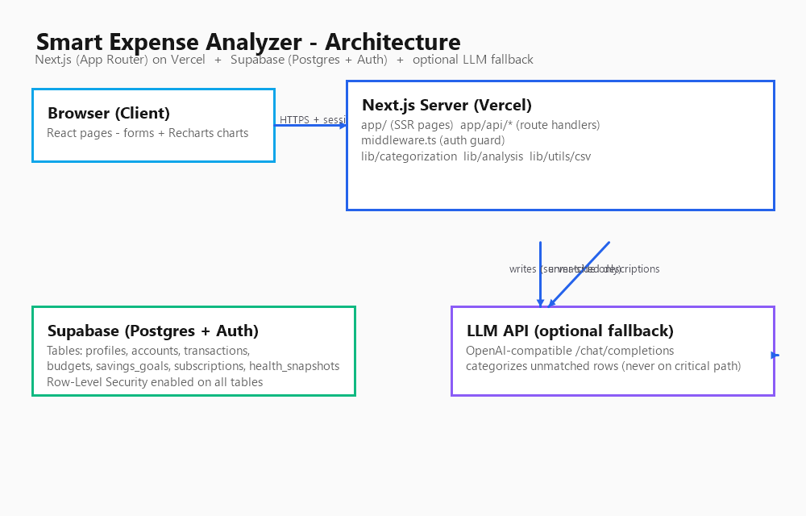

# Smart Expense Analyzer & Financial Health Dashboard

> "Because you can't fix what you can't see — and most people can't see where their money actually goes."

A full-stack web application where users upload or enter their financial transactions, get them automatically categorized, and receive a clear financial health score with personalized, actionable insights. Built for **HackInMotion 2026** (Theme: FinTech & Personal Finance).

---

## Team Information

| Field            | Value                                   |
| ---------------- | --------------------------------------- |
| **Team Code**    | RICR-HIM-1272                           |
| **Team Name**    | _(add team name)_                       |
| **Selected Theme** | FinTech & Personal Finance            |
| **Hackathon**    | HackInMotion 2026 (12–15 Aug 2026)      |

**Team Members** _(fill in):_
1. Name — role
2. Name — role
3. Name — role
4. Name — role

---

## Problem Statement

Most people don't really know where their money goes each month. Bank
statements are long and confusing; budgeting apps are either too complicated
or require tedious manual entry that users abandon within a week. There is no
clear, personalized answer to "are you overspending on food delivery?", "is a
subscription draining your money?", or "are you saving enough?"

Build a **Smart Expense Analyzer & Financial Health Dashboard** — a web app
where a user can input or upload financial transactions, have spending
automatically categorized and analyzed, and receive a clear picture of their
financial health along with personalized, actionable insights.

Full statement: [`problemstatement.md`](problemstatement.md)

---

## Solution Overview

The application is a **single Next.js (App Router) application**: the React
frontend and the backend API routes live in one deployable unit, backed by
**Supabase** (Postgres + Auth) for identity and storage.

Key capabilities:

1. **Secure accounts & authentication** — email/password via Supabase Auth,
   session-guarded middleware, and Row-Level Security so each user's financial
   data is private.
2. **Transaction input & import** — manual entry and CSV upload (simulated bank
   statement) with tolerant parsing (multiple date formats, currency symbols,
   missing fields) and deduplication.
3. **Automatic categorization engine** — a custom **rule-based keyword/merchant
   matcher** that covers the full demo dataset, with an **optional LLM fallback**
   (OpenAI-compatible API) for unmatched rows. The LLM is never on the critical
   path — if it's unavailable, rows fall back to `Uncategorized` and the user can
   retag. *See "Categorization Approach" below.*
4. **Spending pattern analysis** — top categories, month-over-month trends,
   unusual spending spikes, and recurring subscription detection, all derived
   from the user's own data.
5. **Financial health score & recommendations** — a 0–100 score computed from
   spending vs. income, savings rate, and budget adherence, with specific,
   plain-language recommendations generated from actual data.
6. **Budgets & savings goals** — monthly per-category budgets and savings goals
   with progress tracking and overspend alerts.
7. **Visual dashboard** — Recharts-powered charts: spending breakdown, trends,
   budget progress, health score, and score history.

---

## Technology Stack

| Layer       | Technology                                            |
| ----------- | ----------------------------------------------------- |
| Frontend    | Next.js 14 (App Router), React, TypeScript, Tailwind CSS |
| Charts      | Recharts                                              |
| Backend     | Next.js API routes (server-side route handlers)       |
| Database    | PostgreSQL via Supabase                               |
| Auth        | Supabase Auth (email/password, JWT sessions)          |
| Validation  | Zod                                                   |
| CSV parsing | PapaParse                                             |
| Categorization | Custom rules engine + optional OpenAI-compatible LLM |
| Deployment  | Vercel (frontend/API), Supabase (DB)                  |

---

## Categorization Approach

**What we used:** a hybrid engine — a **rule-based keyword/merchant classifier**
we designed ourselves (in `frontend/lib/categorization/rules.ts`) with an
**optional LLM fallback** (OpenAI-compatible chat completion) for unmatched
rows (`frontend/lib/categorization/categorize.ts`).

**Why we chose it:**
- The rule-based layer is fast, free, fully deterministic, and 100% explainable
  — important because judges may ask any team member to explain any module, and
  because it must work offline during a live demo.
- The rule set covers the categories required by the problem statement
  (Food, Groceries, Rent, Shopping, Subscriptions, Travel, Bills, Transport,
  Entertainment, Health, Income, Transfers).
- The LLM fallback improves accuracy on messy or unseen merchant names, but it
  is **never on the critical path**: missing key, timeout, or failure → the row
  stays `Uncategorized` and the user can retag it manually.

**How it's integrated:** every transaction insert (manual, CSV import, and
retroactive `/api/categorize`) runs the rules matcher first. Only unmatched
rows are sent to the LLM in a batched call. Results are mapped back to the
canonical category set.

---

## Installation Guide

Prerequisites: Node.js 18+, a Supabase project.

```bash
# 1. Clone the repository
git clone https://github.com/<team>/RICR-HIM-1272.git
cd RICR-HIM-1272

# 2. Install dependencies
cd frontend
npm install

# 3. Configure environment variables (see next section)
cp .env.local.example .env.local
#   ...fill in Supabase values...

# 4. Run the database migrations
#   Open your Supabase project → SQL Editor → run backend/migrations/001_init.sql

# 5. Start the development server
npm run dev
# open http://localhost:3000
```

---

## Environment Variables

Create `frontend/.env.local`:

```env
NEXT_PUBLIC_SUPABASE_URL=your-project-url
NEXT_PUBLIC_SUPABASE_ANON_KEY=your-anon-key
SUPABASE_SERVICE_ROLE_KEY=your-service-role-key

# Optional: LLM fallback for categorization
LLM_API_KEY=
LLM_BASE_URL=https://api.openai.com/v1
LLM_MODEL=gpt-4o-mini

# For server-side fetches on the dashboard
NEXT_PUBLIC_APP_URL=http://localhost:3000
```

> Never commit `.env.local`. The service role key must only be used server-side.

---

## API Documentation

Full reference: [`api-documentation.md`](api-documentation.md)

| Method | Endpoint                      | Purpose                          |
| ------ | ----------------------------- | -------------------------------- |
| POST   | `/api/transactions`           | Create a transaction             |
| GET    | `/api/transactions`           | List transactions                |
| POST   | `/api/transactions/import`    | Upload CSV                       |
| POST   | `/api/categorize`             | Re-categorize uncategorized rows |
| GET    | `/api/health`                 | Health score + recommendations   |
| GET    | `/api/analyze`                | Spending insights                |
| GET    | `/api/subscriptions`          | Detected subscriptions           |
| GET/POST | `/api/budgets`              | List / upsert budgets            |
| GET/POST | `/api/goals`               | List / create savings goals      |
| GET    | `/api/auth/me`                | Current user + profile           |

---

## Database Details

Hosted PostgreSQL (Supabase), RLS enabled on all tables. Full schema:
[`docs/database-schema.md`](docs/database-schema.md).

Tables: `profiles`, `accounts`, `transactions`, `budgets`, `savings_goals`,
`subscriptions`, `health_snapshots`. All keyed by `user_id` with ownership
policies. `transactions.amount` is signed (negative = spending). Historical
analysis is persisted monthly in `health_snapshots`.

---

## Architecture Diagram



High-level data flow: [`docs/dataflowdiagram.md`](docs/dataflowdiagram.md)
Design spec: [`docs/design.md`](docs/design.md)

---

## Screenshots

_(Add screenshots of the dashboard, transaction import, budgets and health pages.)_

---

## Deployment

**Live demo:** _(add Vercel URL here)_

Deployment steps: push to GitHub → import repo in Vercel → add the environment
variables above → deploy. Supabase handles the database and auth.

---

## Future Scope

- AI chat-based financial assistant ("How much did I spend on food last
  month?")
- Bill reminder system (predict upcoming bills and notify before they're due)
- Multi-account support across cards/wallets in one view (schema already
  reserved via `accounts`)
- Anonymized spending benchmarking against similar income groups
- Savings simulation tool ("what if I cut food delivery by half?")
- Mobile app / PWA offline mode

---

## Repository Structure

```
RICR-HIM-1272
├── frontend/               # Next.js application (pages + API routes)
├── backend/                # Supabase migrations (schema, RLS, seed)
├── docs/                   # Design, data flow, database schema, plans
├── assets/                 # Images, screenshots, sample CSV data
├── architecture-diagram.png
├── api-documentation.md
├── presentation.pptx
├── problemstatement.md
└── README.md
```

---

## License

_(optional — add license if desired)_

Developed during **HackInMotion 2026** organized by Raj Institute of Coding &
Robotics. Code in Motion. Innovate for the Future.
